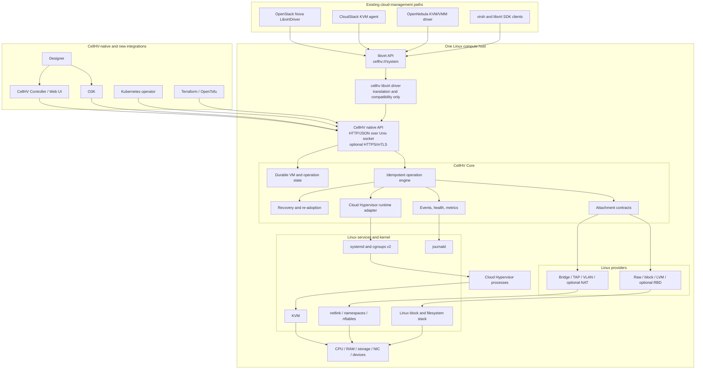

# CellHV Core Foundation Specification

**Status:** Proposed  
**Date:** 2026-07-20  
**Scope:** CellHV Core product boundary, authority model, Linux topology, compatibility strategy, and delivery milestones  
**Related issues:** #183, #184, #185, #186  
**Companion documents:**

- `docs/specs/adr/015-libvirt-first-ecosystem-compatibility.md`
- `docs/specs/contracts/cellhv-libvirt-compatibility-profile-v1.md`
- `docs/specs/cellhv-core-api-cloud-integration-spec.md`
- `docs/specs/cellhv-core-acceptance-test-spec.md`

## 1. Decision

CellHV will be built around a small, autonomous, Linux-native virtualization runtime named **CellHV Core**.

Core MUST work on one Linux host without CellHV Controller, OpenStack, CloudStack, OpenNebula, O3K, Kubernetes, Designer, Web UI, or an external database. It owns durable host and VM identity, accepted VM configuration, requested and observed state, operations, recovery, and adoption of Cloud Hypervisor processes.

CellHV has two deliberate integration surfaces:

1. **Native CellHV API** — the canonical authority-facing API for CellHV Controller, O3K, Designer, Kubernetes, Terraform/OpenTofu, and new systems.
2. **Libvirt compatibility surface** — the primary ecosystem bridge for existing cloud-management systems.

The project will first attempt to integrate OpenStack, CloudStack, and OpenNebula through their existing libvirt-based paths. A platform-specific CellHV adapter is a fallback, not the default.

## 2. Non-negotiable invariants

- Core is useful and recoverable without any management plane.
- Core is the single mutation authority for CellHV-managed VMs.
- Every successful mutation passes through the Core operation journal.
- External systems MUST NOT access the Core database, Cloud Hypervisor sockets, or privileged helper APIs.
- Libvirt compatibility MUST translate into Core operations; it MUST NOT create a second VM authority.
- Controller or cloud-platform loss MUST NOT stop existing workloads.
- Ambiguous running workloads are preserved rather than deleted.
- Root privilege is isolated behind narrow validated host operations.
- Cloud Hypervisor is the primary VMM.
- Core contains no cloud tenant, project, scheduler, billing, image-catalogue, or global-network model.
- Unsupported compatibility behavior fails explicitly.

## 3. Normative decision classes

| Class | Meaning | Change process |
|---|---|---|
| **Invariant** | Defines the product identity or safety boundary. | New architecture decision. |
| **Default architecture** | Selected implementation expected to be used. | ADR before replacement. |
| **Candidate** | Requires a spike or qualification before adoption. | Experiment and review. |

### 3.1 Default architecture

- `cellhvd` owns durable state, operations, recovery, native API, events, and runtime adoption.
- SQLite is the initial local durable store.
- A narrow privileged helper, provisionally `cellhv-hostd`, performs approved Linux mutations.
- The native API is HTTP/JSON described by OpenAPI 3.1.
- Local native access uses HTTP over a Unix-domain socket.
- Optional managed access uses HTTPS with mTLS.
- systemd and cgroups v2 provide supervision and accounting.
- Cloud Hypervisor lifecycle is accessed through a narrow runtime adapter.
- The libvirt compatibility target is a libvirt hypervisor driver that delegates to Core, provisionally exposed as `cellhv:///system`.

### 3.2 Candidates requiring spikes

- upstream `cellhv` driver versus a downstream incubation package;
- reuse or extension of the existing libvirt `ch` driver;
- persistent versus transient systemd units;
- exact helper boundary;
- provider library versus helper-process model;
- peer-credential authorization details;
- raw versus qcow2 defaults;
- event-watch transport;
- TPM-backed identity and secret storage.

## 4. Product position

CellHV Core is:

> A minimal Linux-native compute-node runtime for modern cloud and edge workloads, with a native API for new systems and a bounded libvirt compatibility profile for existing ecosystems.

CellHV does not initially claim:

- complete libvirt API coverage;
- libvirt remote-protocol reimplementation;
- QEMU feature parity;
- XAPI compatibility;
- drop-in XCP-ng compatibility;
- universal VMware compatibility;
- legacy device emulation;
- automatic compatibility with a cloud platform before qualification.

“Libvirt compatible” means the published CellHV libvirt profile passes. It does not mean every libvirt API is supported.

## 5. Topology

The libvirt driver is a compatibility facade. It MUST call the same Core service/API used by native clients and MUST NOT launch Cloud Hypervisor directly.

## 6. Architecture layers

### 6.1 Minimal Core runtime

Core owns:

- host and VM identity;
- accepted VM specification;
- requested and observed power state;
- durable operations and idempotency;
- process supervision and re-adoption;
- attachment records;
- local native API;
- events, health, and minimal metrics;
- reboot and crash recovery.

The minimal runtime does not require remote management, libvirt, managed networking, LVM provisioning, Ceph, NAT, or a cloud platform.

### 6.2 Linux providers

Providers implement narrow contracts for preparing, attaching, inspecting, recovering, detaching, and releasing Linux resources. Provider capability is advertised only after its qualification profile passes.

### 6.3 Native API

The native API is the canonical CellHV contract. It exists so CellHV-native systems are not constrained by legacy libvirt vocabulary. It remains small, versioned, idempotent, and operation-oriented.

### 6.4 Libvirt compatibility

The compatibility layer maps a bounded subset of:

- libvirt connection and capability APIs;
- domain XML;
- lifecycle APIs;
- disk and NIC attachment APIs;
- events and basic statistics;

into native Core resources and operations.

The target URI is `cellhv:///system`. The existing `ch:///system` driver is a reference implementation and experimental baseline, not the final CellHV authority path, because it currently manages Cloud Hypervisor directly.

### 6.5 Management systems

Existing platforms should first be tested unchanged, using their normal libvirt path plus configuration. Small upstream generalisations are preferred over CellHV-specific platform plugins. A dedicated adapter requires a separate ADR demonstrating that the libvirt path is insufficient or unsafe.

## 7. Authority and concurrency rules

- A VM has one Core UUID and one operation history.
- Native and libvirt requests resolve to the same VM and operation resources.
- Libvirt domain UUID is the Core VM UUID.
- Repeated platform requests use stable idempotency mappings.
- Concurrent conflicting writes are rejected through resource versions or operation conflicts.
- Direct access to Cloud Hypervisor sockets by libvirt or platform agents is forbidden in CellHV mode.
- Manual changes outside Core are detected and classified; destructive reconciliation is never automatic when ownership is ambiguous.

## 8. Initial workload boundary

The first qualification target is:

- Ubuntu Server 24.04 LTS host;
- x86-64;
- one pinned kernel range;
- one pinned Cloud Hypervisor release;
- one pinned firmware path;
- one modern Ubuntu LTS cloud image;
- virtio block, network, and serial devices;
- pre-existing raw/block storage;
- pre-existing Linux bridge or TAP.

Selected modern Windows images follow after the Linux profile is stable.

## 9. Milestones

### M0 — Contracts and authority

- Core domain and operation model;
- SQLite store;
- native API skeleton;
- ADR-015 accepted;
- libvirt compatibility profile v1 published;
- no real VM required.

### M1 — Minimal standalone runtime

- one qualified Linux VM;
- create, inspect, start, stop, and delete;
- pre-existing storage and network attachment;
- no Controller or libvirt requirement.

### M2 — Recovery

- daemon restart and re-adoption;
- host reboot recovery;
- fail-closed database behavior;
- crash-after-commit recovery;
- lifecycle leak tests.

### M3 — Libvirt compatibility preview

- `cellhv:///system` prototype;
- `virsh` and standard libvirt bindings;
- lifecycle, XML, events, statistics, disk, and NIC profile;
- all mutations visible in the Core operation journal;
- explicit unsupported matrix.

### M4 — Existing-cloud compatibility preview

- unchanged OpenStack Nova LibvirtDriver experiment;
- unchanged CloudStack KVM-agent experiment;
- unchanged OpenNebula KVM/VMM experiment;
- gap matrices and upstream-generalisation proposals;
- no CellHV-specific platform adapter unless separately approved.

### Beta — Providers and managed endpoint

- privileged helper isolation;
- qualified bridge/VLAN/raw/LVM providers;
- HTTPS/mTLS, enrollment, and leases;
- Controller and O3K use native API.

### 1.0 — Qualification

- standalone and recovery profiles;
- libvirt compatibility profile;
- at least one existing cloud platform qualified without a CellHV-specific adapter;
- a documented decision for OpenStack and CloudStack based on measured gaps;
- upgrade/rollback, soak, signed packages, checksums, and SBOM.

## 10. Explicit non-goals for Core 1.0

- full libvirt support matrix;
- QEMU monitor compatibility;
- XenAPI;
- legacy hardware emulation;
- distributed cluster consensus;
- fleet scheduling;
- billing, tenants, and quotas;
- Designer execution inside Core;
- built-in Ceph deployment;
- automatic fallback adapters without an ADR.

## 11. Change control

Changes affecting authority, libvirt mapping, platform compatibility, or Core public APIs require:

- linked ADR or contract change;
- compatibility and migration analysis;
- acceptance scenario updates;
- explicit unsupported behavior;
- proof that Core remains standalone and single-authority.
