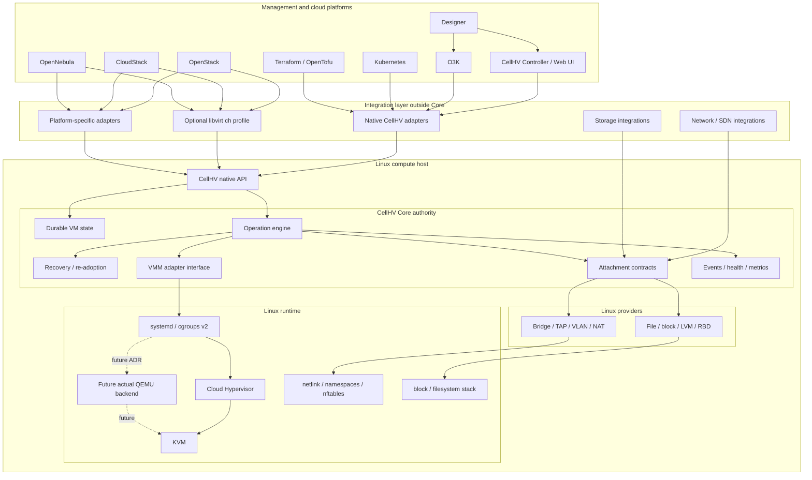

# CellHV Core Foundation Specification

**Status:** Proposed  
**Date:** 2026-07-20  
**Scope:** Core product boundary, authority, Linux topology, VMM policy, and ecosystem integration  
**Related issues:** #183, #184, #185, #186

## 1. Product decision

CellHV will be built around **CellHV Core**, a small autonomous Linux-native virtualization runtime.

Core MUST operate on one Linux host without Controller, libvirt, OpenStack, CloudStack, OpenNebula, O3K, Kubernetes, Designer, Web UI, or an external database.

Core owns:

- durable host and VM identity;
- accepted VM configuration;
- requested and observed runtime state;
- operation journal and idempotency;
- process supervision and re-adoption;
- attachment records;
- crash and reboot recovery;
- public native API, events, health, and metrics.

Cloud Hypervisor is the primary Core 1.0 VMM. Core is designed around a narrow internal VMM interface so another real VMM may be added later without changing Core authority.

## 2. Non-negotiable invariants

- Core is useful and recoverable without a management plane.
- Core is the single mutation authority for CellHV-managed VMs.
- Every mutation passes through the operation journal.
- External systems do not access the Core database, privileged helper, or VMM sockets.
- Management-plane loss does not stop existing workloads.
- Ambiguous running workloads are preserved.
- Root privilege is isolated behind narrow validated operations.
- Capabilities describe only executable behavior.
- Cloud-platform models do not enter Core.
- Cloud Hypervisor MUST NOT be advertised as QEMU.
- Hypervisor, network, storage, and platform compatibility are qualified separately.
- Unsupported behavior fails explicitly.

## 3. Normative classes

| Class | Meaning | Change process |
|---|---|---|
| Invariant | Product or safety boundary | superseding ADR |
| Default architecture | selected implementation | ADR before replacement |
| Candidate | requires experiment | spike and review |

### Default architecture

- `cellhvd` owns state, operations, recovery, and native API.
- SQLite is the first local durable store.
- `cellhv-hostd` is a narrow privileged helper.
- Native API is HTTP/JSON with OpenAPI 3.1.
- Local access is HTTP over a Unix socket.
- Managed remote access is optional HTTPS/mTLS.
- systemd and cgroups v2 provide process supervision and accounting.
- Cloud Hypervisor is the first VMM adapter.
- network and storage are provider contracts, not VMM identity.

### Candidates

- bounded `ch:///system` compatibility profile;
- OpenStack native ComputeDriver;
- CloudStack extension or hypervisor plugin;
- OpenNebula VMM driver;
- future actual QEMU VMM adapter;
- standard libvirt network/storage coexistence;
- provider process model;
- exact systemd unit model;
- TPM-backed identity.

## 4. Product position

> CellHV Core is a minimal Linux-native compute runtime for building cloud and edge platforms, with a stable native API and evidence-driven compatibility integrations.

CellHV does not claim:

- complete libvirt compatibility;
- QEMU identity while using Cloud Hypervisor;
- XAPI compatibility;
- universal VMware compatibility;
- automatic compatibility from a URI;
- complete legacy device emulation;
- zero-change integration with every cloud platform.

## 5. Topology

The optional libvirt compatibility layer and platform adapters are clients of public Core APIs. They do not become runtime authorities.

## 6. Compatibility model

Compatibility is a tuple, not one boolean.

Every claim identifies:

- VMM backend;
- hypervisor interface;
- network path;
- storage path;
- cloud-platform integration path;
- workload and version matrix.

The normative claim format is defined in `docs/specs/contracts/cellhv-compatibility-claims-v1.md`.

### Cloud Hypervisor/libvirt

`ch:///system` is evaluated as an optional bounded profile. It is useful for generic libvirt clients but is not assumed to be widely accepted by cloud platforms.

### QEMU

CellHV does not emulate QEMU or QMP around Cloud Hypervisor.

A future QEMU backend may use the existing QEMU/libvirt ecosystem only when it actually runs QEMU and passes a separate qualification profile.

### Network and storage

Network and storage providers are independent from the VMM. A cloud integration may use CellHV providers, standard libvirt drivers, or external systems, provided ownership and recovery are explicit.

## 7. Architecture layers

### Minimal Core

- VM identity and specification;
- lifecycle and operation journal;
- Cloud Hypervisor adapter;
- pre-existing disk and network attachments;
- restart/reboot recovery;
- local native API.

### Standard providers

- managed bridge and VLAN;
- isolated and NAT networks;
- raw-file and LVM provisioning;
- Ceph RBD and later providers.

### Managed endpoint

- HTTPS/mTLS;
- enrollment;
- certificate rotation;
- management leases;
- Controller connector.

### Management products

- CellHV Controller and Web UI;
- O3K;
- Designer;
- cloud-platform integrations;
- Kubernetes and Terraform integrations.

## 8. Milestones

### M0 — Authority and contracts

- Core domain model;
- operation journal;
- SQLite schema;
- native API contract;
- compatibility-claims contract;
- no real VM required.

### M1 — Minimal standalone runtime

- one Linux VM on Cloud Hypervisor;
- pre-existing disk and bridge/TAP;
- create, inspect, start, stop, delete;
- no Controller or libvirt.

### M2 — Recovery

- daemon re-adoption;
- host reboot;
- fail-closed database;
- crash-after-commit recovery;
- resource-leak tests.

### M3 — Compatibility discovery

- upstream `ch` support matrix;
- OpenStack, CloudStack, and OpenNebula integration discovery;
- separate network/storage gap analysis;
- no assumption that one URI solves platform compatibility.

### M4 — First supported cloud integration

Select and implement the safest maintainable path for OpenStack first:

- generic libvirt `ch` path;
- generic upstream change;
- official native CellHV adapter.

CloudStack follows with its selected path. Each path requires a published claim tuple and conformance profile.

### Beta — Providers and managed endpoint

- privileged helper;
- standard network and storage providers;
- mTLS and enrollment;
- Controller and O3K native API integration.

### 1.0 — Qualification

- standalone and recovery profiles;
- one supported OpenStack integration path;
- documented CloudStack gap report and selected implementation path;
- advertised network/storage providers;
- upgrade/rollback, security, soak, packages, checksums, and SBOM.

The optional `ch` profile is required only when advertised.

## 9. Explicit non-goals for Core 1.0

- QEMU impersonation;
- QMP emulation;
- complete libvirt API;
- mandatory `ch:///system`;
- mandatory platform-specific adapters for every cloud;
- actual QEMU backend unless separately approved;
- distributed cluster consensus;
- fleet scheduling;
- tenant, billing, or quota models;
- Designer execution inside Core;
- built-in Ceph cluster deployment.

## 10. Change control

Changes affecting VMM identity, Core authority, public APIs, compatibility claims, provider ownership, or platform paths require:

- ADR or contract update;
- acceptance scenario update;
- migration and rollback analysis;
- explicit unsupported behavior;
- proof that Core remains standalone and single-authority.
