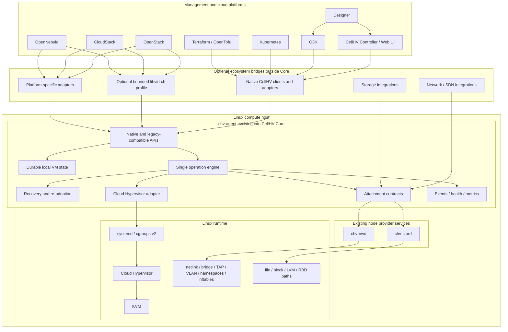

# CellHV Core Foundation Specification

**Status:** Proposed  
**Date:** 2026-07-21  
**Scope:** Core product boundary, authority, Linux topology, migration from the existing node runtime, and staged ecosystem integration  
**Related issues:** #183, #184, #185, #186  
**Decisions:** ADR-015, ADR-016

## 1. Product decision

CellHV will be built around **CellHV Core**, a self-contained Linux-native compute runtime with optional ecosystem bridges.

The existing `chv-agent` evolves in place into CellHV Core. `cellhvd` is not a second daemon, binary, state store, or runtime authority. Until a separate naming ADR is accepted, the executable and systemd service remain `chv-agent`.

Core MUST operate on one Linux host without Controller, libvirt, OpenStack, CloudStack, OpenNebula, O3K, Kubernetes, Designer, Web UI, or an external database.

Core owns:

- durable host and VM identity;
- accepted VM configuration;
- requested and observed runtime state;
- operation journal and idempotency;
- Cloud Hypervisor process supervision and re-adoption;
- attachment records;
- crash and reboot recovery;
- native API, events, health, and metrics.

Cloud Hypervisor is the only active VMM target for Core 1.0.

## 2. Locked decisions and provisional work

The architecture distinguishes decisions that are locked now from integration hypotheses that require evidence.

### Locked

- `chv-agent` becomes the Core runtime in place.
- Core is useful without a management plane.
- Core is the single mutation authority for CellHV-managed VMs.
- Every mutation passes through one durable operation engine.
- Cloud Hypervisor is represented truthfully and never as QEMU.
- Hypervisor, network, storage, and cloud-platform compatibility are separate claim axes.
- Cloud-platform code remains outside Core and uses public contracts.
- Management-plane loss does not stop existing workloads.

### Provisional until tested

- exact native API transport and endpoint details beyond the required semantics;
- whether the bounded `ch:///system` profile provides enough value to maintain;
- the first OpenStack integration path;
- the first CloudStack and OpenNebula integration paths;
- exact privileged-helper and provider process boundaries;
- final binary/package branding;
- exact supported host, VMM, firmware, and guest versions.

A provisional item MUST NOT become a support claim without the required discovery or acceptance evidence.

## 3. Non-negotiable invariants

- Core is useful and recoverable without a management plane.
- `chv-agent` and CellHV Core are the same runtime authority.
- No parallel `cellhvd` runtime is introduced.
- Every mutation is durably recorded before host-side effects.
- External systems do not access the Core database, privileged helper, or VMM sockets.
- Management-plane loss does not stop existing workloads.
- Ambiguous running workloads are preserved.
- Root privilege is isolated behind narrow validated operations.
- Capabilities describe only executable behavior.
- Cloud-platform models do not enter Core.
- Cloud Hypervisor MUST NOT be advertised as QEMU.
- Network, storage, VMM, and platform compatibility are qualified separately.
- Unsupported behavior fails explicitly.

## 4. Default architecture

- `chv-agent` owns local state, operations, recovery, and the native API.
- SQLite is the first local durable store.
- Existing `chv-agent` gRPC/control-plane compatibility is retained during migration and routed into the same operation engine.
- Native local access uses a versioned API over a Unix socket; HTTP/JSON with OpenAPI 3.1 is the current default, subject to implementation validation.
- Managed remote access is optional and added after standalone recovery is proven.
- systemd and cgroups v2 provide process supervision and accounting.
- Cloud Hypervisor is the Core 1.0 VMM.
- `chv-stord` and `chv-nwd` remain existing provider services until a later bounded decision changes their role.
- Network and storage are attachment/provider contracts, not properties of a VMM URI.

## 5. Product position

> CellHV Core is a self-contained compute runtime for modern cloud and edge workloads, built by evolving `chv-agent` into a locally authoritative, recoverable Linux service with optional ecosystem bridges.

CellHV does not claim:

- complete libvirt compatibility;
- QEMU identity while using Cloud Hypervisor;
- XAPI compatibility;
- universal VMware compatibility;
- automatic cloud compatibility from a URI;
- complete legacy device emulation;
- zero-change integration with every cloud platform;
- loose coupling in the sense of implementation independence from Linux, Cloud Hypervisor, or the selected provider contracts.

Core is deliberately opinionated about Linux, KVM, Cloud Hypervisor, durable local authority, and explicit attachment semantics.

## 6. Topology

No bridge becomes a second VM authority. `chv-agent` remains the only CellHV runtime owner.

## 7. Compatibility model

Compatibility is a tuple, not a boolean. Every claim identifies:

- VMM backend;
- hypervisor management interface;
- network path;
- storage path;
- cloud-platform integration path;
- workload and version matrix.

The normative format is `docs/specs/contracts/cellhv-compatibility-claims-v1.md`.

### Libvirt

`ch:///system` is an optional bounded discovery and compatibility profile. It is not assumed to be accepted by OpenStack, CloudStack, or OpenNebula. Passing the libvirt profile proves only that profile.

### Network and storage

Network and storage are qualified independently from VM lifecycle. A platform may use existing CellHV services, platform-prepared endpoints, or future qualified providers, provided ownership, recovery, and cleanup are explicit.

### Other VMMs

Other VMM backends are outside the active Core 1.0 roadmap. They must not appear in implementation prompts, milestone commitments, or topology diagrams. Any future proposal requires a separate business case and ADR.

## 8. Active delivery milestones

### Phase A — migration baseline and OpenStack discovery

- map current `chv-agent` authority and dependencies;
- lock the in-place evolution path;
- add dependency and identity guards;
- run a time-boxed OpenStack/`ch:///system` discovery spike;
- publish evidence and unresolved gaps.

### Phase B — local authority in `chv-agent`

- durable SQLite state;
- one operation engine for legacy and native requests;
- idempotency and resource versions;
- native local API skeleton;
- no second daemon.

### Phase C — standalone runtime and recovery

- one qualified Linux VM through Cloud Hypervisor;
- pre-existing disk and network endpoints;
- daemon restart and process re-adoption;
- host reboot and fail-closed database behavior;
- real-KVM leak and fault testing.

### Phase D — minimum provider and privilege hardening

- preserve and narrow `chv-stord`/`chv-nwd` boundaries;
- validate attachment ownership;
- restrict privileged host mutations;
- qualify only the minimum providers required by the first OpenStack path.

### Phase E — first supported OpenStack path

- select generic libvirt, generic upstream change, or native adapter from evidence;
- qualify Nova lifecycle, Neutron network, and Cinder storage separately;
- publish version matrix, limitations, and maintainer ownership.

### Phase F — Controller/O3K integration and Core 1.0 qualification

- migrate Controller and O3K to the public Core authority path;
- prove manager removal and projection rebuild;
- package, upgrade, rollback, security, and soak qualification;
- publish Core 1.0 support claims.

CloudStack and OpenNebula remain strategic targets, but their implementation programmes begin only after the OpenStack path and Core authority are stable.

## 9. Planning assumptions

This is a planning estimate, not a delivery promise.

Assumed minimum capacity:

- one dedicated senior Rust/Linux virtualization engineer;
- half-time infrastructure/test engineering support;
- access to disposable KVM and OpenStack labs;
- architecture review availability at each phase gate.

Indicative schedule from July 2026:

| Period | Target |
|---|---|
| Q3 2026 | Phase A and start Phase B |
| Q4 2026 | complete Phase B and Phase C minimal runtime |
| Q1 2027 | recovery hardening and Phase D |
| Q2 2027 | Phase E OpenStack integration |
| Q3 2027 | Phase F and Core 1.0 qualification |

With less than one dedicated senior engineer, the schedule must be extended rather than reducing recovery or acceptance requirements.

## 10. Explicit non-goals for Core 1.0

- a new parallel `cellhvd` service;
- flag-day rewrite of `chv-agent`;
- QEMU impersonation or QMP emulation;
- another VMM backend;
- complete libvirt API;
- mandatory `ch:///system`;
- support for every cloud platform;
- distributed cluster consensus;
- fleet scheduling;
- tenant, billing, or quota models;
- Designer execution inside Core;
- built-in Ceph cluster deployment.

## 11. Change control

Changes affecting agent/Core identity, VMM identity, local authority, public APIs, compatibility claims, provider ownership, or platform paths require:

- ADR or contract update;
- acceptance scenario update;
- migration and rollback analysis;
- explicit unsupported behavior;
- proof that `chv-agent` remains the single standalone runtime authority.
